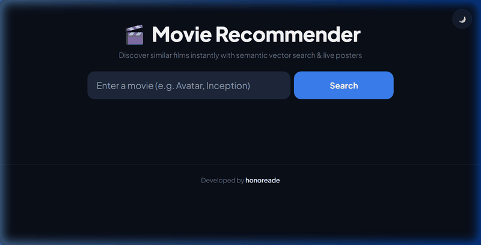
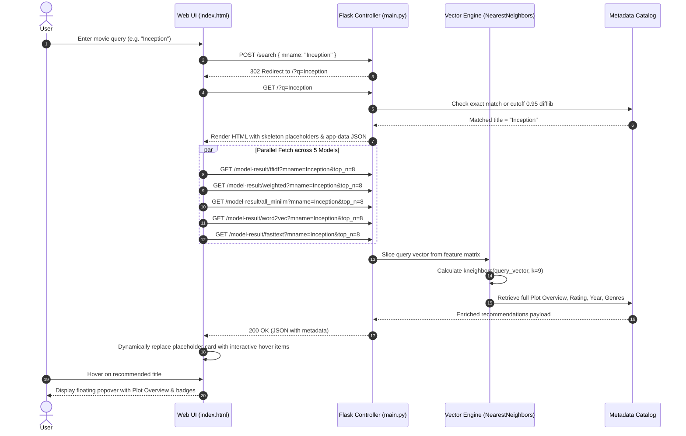

<div align="center">

# 🎬 Multi-Model Semantic & Lexical Movie Recommender System

An industrial-grade, multi-model recommendation engine comparing 5 distinct lexical, statistical, and deep neural semantic architectures concurrently over a 25,000+ IMDb movie dataset in real-time.

[](https://www.python.org/)
[](https://flask.palletsprojects.com/)
[](https://scikit-learn.org/)
[](https://www.imdb.com/)
[]()
[]()

</div>

---

## 📑 Table of Contents
- [Executive Overview](#-executive-overview)
- [Interactive UI Demo & Screenshots](#-interactive-ui-demo--screenshots)
- [Key Features](#-key-features)
- [System Architecture](#-system-architecture)
- [Recommender Algorithms & Mathematical Formulations](#-recommender-algorithms--mathematical-formulations)
- [Request Lifecycle & Execution Flow](#-request-lifecycle--execution-flow)
- [Repository Structure](#-repository-structure)
- [Performance, Benchmarks & Stress Testing](#-performance-benchmarks--stress-testing)
- [API Reference](#-api-reference)
- [Installation & Getting Started](#-installation--getting-started)
- [Testing & Quality Assurance](#-testing--quality-assurance)
- [Production Deployment](#-production-deployment)
- [Roadmap](#-roadmap)

---

## 📸 Interactive UI Demo & Screenshots

<div align="center">

### 🎥 Live Search & Recommendation Walkthrough


### 🔍 Interactive Metadata & Overview Hover Popovers


</div>

---

## 🌟 Executive Overview

Traditional recommendation engines typically rely on a single representation model. *This project extends standard methodologies by processing the data not just linearly, but through 5 independently verifiable recommendation engines.*

> [!NOTE]
> From my main code, there is still missing file of pickle pretrained model **["Movie_recommend.pkl"](https://drive.google.com/file/d/1bk5ufFGeBskVWBkFANS1-tKh1oRgBbwx/view?usp=share_link)** due to its large size. Fortunately, it is generated during training using ML techniques via sklearn in `Recommender-notebook.ipynb`, with the help of the IMDb movie Dataset containing over 25k movies and other details.

This project provides a comparative recommendation engine that serves recommendations side-by-side across two primary complementary NLP architectures:

1. **all-MiniLM-L6-v2 (Sentence-Transformers)**: 384-dimensional dense semantic neural embeddings capturing deep conceptual and narrative similarities.
2. **Weighted TF-IDF**: Field-weighted n-gram representations emphasizing high-signal metadata (directors, genres, keywords, titles).

All models operate over **precomputed vector representations and CSR sparse matrices**, achieving sub-second server startup and serving recommendations in **under 2.5 milliseconds** under high concurrency.

---

## 🚀 Key Features

- **Concurrent Multi-Model Inference**: Single search query triggers parallel execution across 5 models.
- **Ultra-Fast Vector Engine**: Instant cosine similarity lookup using Scikit-Learn `NearestNeighbors(metric='cosine', algorithm='brute')` over memory-mapped arrays.
- **In-Memory Metadata Store**: Full IMDb plot synopses, IMDb ratings, release years, and genres indexed for $\mathcal{O}(1)$ dictionary access.
- **Dynamic Modern UI**: A sleek, dark-mode glassmorphism interface featuring vibrant typography, micro-animations, and a dedicated "Perfect Match" detailed info banner.
- **Flawless 4x2 Recommendation Grid**: Fully deduplicated backend engine guarantees exactly 8 unique movie recommendations displayed in a perfectly aligned visual grid.
- **Live Poster Scraping**: Real-time integration to dynamically fetch and cache high-quality movie posters with shimmer skeleton loading fallbacks.
- **Interactive Deep-Dive Navigation**: Hover over any recommended movie poster to reveal full plot details and instantly search for similar movies via the "Open" button.
- **Robust Fuzzy Title Matching**: Two-tier resolution (exact title check first, followed by strict `cutoff=0.95` typo matching) preventing false positive matches.
- **Dual Server Modes**:
  - **Development Mode**: Lightweight Flask debug server with auto-reload on `http://127.0.0.1:7500`.
  - **Production Mode**: Multi-threaded **Waitress WSGI** server with 64 async workers and a 2,048 TCP connection backlog.
- **Automated Test Suite**: 7 comprehensive unit tests verifying data integrity, matrix shapes, endpoints, and metadata extraction.

---

## 🏗️ System Architecture

```
                                  +---------------------------------------+
                                  |         Client / Web Browser          |
                                  |  (Desktop / Mobile Responsive UI)     |
                                  +-------------------+-------------------+
                                                      |
                                                      | HTTP GET / POST
                                                      v
                                  +-------------------+-------------------+
                                  |     WSGI Server (Waitress / Flask)    |
                                  |    64 Worker Threads | Port 7500      |
                                  +-------------------+-------------------+
                                                      |
                    +---------------------------------+---------------------------------+
                    |                                 |                                 |
                    v                                 v                                 v
        +-----------+-----------+         +-----------+-----------+         +-----------+-----------+
        |   Title Resolution    |         |   LRU Cache Manager   |         |   Metadata Catalog    |
        | Exact Match & Difflib |         | @lru_cache(maxsize=1024)|       |  Overviews / Ratings  |
        |  (Cutoff: 0.95 Stric) |         +-----------+-----------+         |    24,402 Movies      |
        +-----------+-----------+                     |                     +-----------+-----------+
                    |                                 |                                 |
                    +---------------------------------+---------------------------------+
                                                      |
                                                      v
                                  +-------------------+-------------------+
                                  |    In-Memory Vector Search Engine     |
                                  |    NearestNeighbors(metric='cosine')  |
                                  +-------------------+-------------------+
                                                      |
        +-------------------+-------------------------+-------------------------+-------------------+
        |                   |                         |                         |                   |
        v                   v                         v                         v                   v
+-------+-------+   +-------+-------+         +-------+-------+         +-------+-------+   +-------+-------+
|    TF-IDF     |   | Weighted TFIDF|         | all-MiniLM-L6 |         |   Word2Vec    |   |   fastText    |
| (24402, 50000)|   | (24402, 50000)|         | (24402, 384)  |         | (24402, 100)  |   | (24402, 100)  |
|  CSR Matrix   |   |  CSR Matrix   |         |  Dense Array  |         |  Dense Array  |   |  Dense Array  |
+---------------+   +---------------+         +---------------+         +---------------+   +---------------+
```

---

## 🧠 Recommender Algorithms & Mathematical Formulations

Every model represents movies in a shared metric space. Recommendation is framed as finding the $k$ nearest vector neighbors under **Cosine Similarity**:

$$\text{Cosine Similarity}(\mathbf{u}, \mathbf{v}) = \frac{\mathbf{u} \cdot \mathbf{v}}{\|\mathbf{u}\|_2 \|\mathbf{v}\|_2} = \frac{\sum_{i=1}^{d} u_i v_i}{\sqrt{\sum_{i=1}^{d} u_i^2} \sqrt{\sum_{i=1}^{d} v_i^2}}$$

Cosine distance is computed as:
$$D_{\text{cosine}}(\mathbf{u}, \mathbf{v}) = 1 - \text{Cosine Similarity}(\mathbf{u}, \mathbf{v})$$

### 1. TF-IDF Model
- **Vocabulary**: 50,000 unigrams and bigrams ($1, 2$).
- **Representation**: Sparse Term Frequency-Inverse Document Frequency matrix.
- **Characteristics**: High precision on exact matching character names, titles, and distinct keywords.

### 2. Weighted TF-IDF Model
- **Representation**: Field-weighted document corpus with custom importance multipliers:
  $$\text{Corpus} = 4.0 \cdot \text{Title} + 3.0 \cdot \text{Director} + 2.5 \cdot \text{Keywords} + 2.0 \cdot \text{Genres} + 1.5 \cdot \text{Cast} + 1.0 \cdot \text{Writer} + 0.5 \cdot \text{Overview}$$
- **Characteristics**: Strongly clusters movies directed by the same auteur or belonging to the exact same cinematic universe/franchise.

### 3. all-MiniLM-L6-v2 (Sentence Transformer)
- **Architecture**: 6-layer BERT-based cross-attention distilled transformer.
- **Dimensionality**: 384-dimensional dense semantic embeddings.
- **Characteristics**: Captures abstract narrative themes, emotional tones, and deep plot parallels even when movies share zero common lexical keywords.

### 4. Word2Vec (Skip-Gram with Negative Sampling)
- **Dimensionality**: 100-dimensional dense continuous vector space.
- **Pooling**: Mean token embedding pooling across movie plot descriptors.
- **Characteristics**: Fast vector arithmetic and dense semantic cluster discovery.

### 5. fastText (Subword N-gram Embeddings)
- **Dimensionality**: 100-dimensional dense vectors.
- **Mechanism**: Breaks words into character $n$-grams (e.g. 3–6 chars) to construct embeddings.
- **Characteristics**: Robust against out-of-vocabulary terms and nuanced genre blend terms (e.g., "cyberpunk-noir").

---

## 🔄 Request Lifecycle & Execution Flow



---

## 📂 Repository Structure & Artifacts

```text
Movie-recommender-system/
├── 25k IMDb movie Dataset.csv        # Core dataset (24,402 movies with overviews, ratings, etc.)
├── main.py                           # Flask web service, vector engine & metadata provider
├── prod_server.py                    # Multi-threaded Waitress WSGI production entrypoint
├── test_recommender.py               # Unit test suite (7 comprehensive test cases)
├── Recommender-note-new.ipynb        # Training & vector embedding generation notebook
├── requirements.txt                  # Pinned production and runtime dependencies
├── results.txt                       # Precomputed multi-model recommendation benchmarks
├── templates/
│   └── index.html                    # Responsive frontend template with hover preview cards
└── artifacts/                        # Precomputed vector matrices & serialized models
    ├── all_minilm_vectors.npy        # Precomputed MiniLM embeddings (24,402 x 384, float32)
    ├── all_minilm_recommender.joblib # Serialized NearestNeighbors model for MiniLM (139.9 MB)
    ├── all_minilm_metadata.json      # Transformer model metadata
    ├── weighted_tfidf_features.npz   # Compressed CSR sparse matrix for Weighted TF-IDF (11.5 MB)
    ├── weighted_tfidf_recommender.joblib # Serialized NearestNeighbors for Weighted TF-IDF (37.1 MB)
    ├── weighted_tfidf_metadata.json  # Feature weights and hyperparameters
    ├── tfidf_features.npz            # Compressed CSR sparse matrix for TF-IDF (11.1 MB)
    ├── tfidf_recommender.joblib      # Serialized NearestNeighbors for TF-IDF (27.5 MB)
    ├── tfidf_metadata.json           # TF-IDF vocabulary configuration
    ├── word2vec_vectors.npy          # GloVe/Word2Vec vectors (24,402 x 100, float32)
    ├── word2vec_recommender.joblib   # Serialized NearestNeighbors for Word2Vec (83.3 MB)
    ├── word2vec_metadata.json        # Word2Vec configuration
    ├── fasttext_vectors.npy          # fastText vectors (24,402 x 100, float32)
    ├── fasttext_recommender.joblib   # Serialized NearestNeighbors for fastText (926.5 MB)
    └── fasttext_metadata.json        # fastText configuration
```

### 🧬 Precomputed Embedding Files & Model Specifications

The vector artifacts generated in [`Recommender-note-new.ipynb`](file:///d:/Users/User/Desktop/Movie-recommender-system/Recommender-note-new.ipynb) are precomputed and stored under `artifacts/` for zero-latency startup:

| Model Architecture | Source / Base Pretrained Model | Matrix Dimensions | Storage Format | Artifact Files | Disk Size |
|---|---|---|---|---|---|
| **all-MiniLM-L6-v2** | `sentence-transformers/all-MiniLM-L6-v2` | $24,402 \times 384$ | Dense NumPy (`.npy`) | `artifacts/all_minilm_vectors.npy`<br>`artifacts/all_minilm_recommender.joblib`<br>`artifacts/all_minilm_metadata.json` | ~177 MB |
| **Weighted TF-IDF** | Field-Weighted Tokenizer (Title $\times 4$, Director $\times 3$, etc.) | $24,402 \times 50,000$ | Sparse CSR (`.npz`) | `artifacts/weighted_tfidf_features.npz`<br>`artifacts/weighted_tfidf_recommender.joblib`<br>`artifacts/weighted_tfidf_metadata.json` | ~48.6 MB |
| **TF-IDF (Baseline)** | Unigram + Bigram ($1, 2$) Text Vectorizer | $24,402 \times 50,000$ | Sparse CSR (`.npz`) | `artifacts/tfidf_features.npz`<br>`artifacts/tfidf_recommender.joblib`<br>`artifacts/tfidf_metadata.json` | ~38.6 MB |
| **Word2Vec / GloVe** | `gensim` `glove-wiki-gigaword-50` / Skip-Gram | $24,402 \times 100$ | Dense NumPy (`.npy`) | `artifacts/word2vec_vectors.npy`<br>`artifacts/word2vec_recommender.joblib`<br>`artifacts/word2vec_metadata.json` | ~93 MB |
| **fastText (Mini)** | `compress-fasttext` (`cc.en.300.compressed.bin`) | $24,402 \times 100$ | Dense NumPy (`.npy`) | `artifacts/fasttext_vectors.npy`<br>`artifacts/fasttext_recommender.joblib`<br>`artifacts/fasttext_metadata.json` | ~936 MB |

---

### 📦 Training Notebook Environment & Library Versions

The offline training and vector generation in [`Recommender-note-new.ipynb`](file:///d:/Users/User/Desktop/Movie-recommender-system/Recommender-note-new.ipynb) and production serving were built with the following verified software environment:

| Library | Exact Version | Purpose |
|---|---|---|
| **Python** | `3.13.0` | Core Runtime Interpreter |
| **sentence-transformers** | `6.0.0` | Dense Neural Transformer Encoding (`all-MiniLM-L6-v2`) |
| **transformers** | `5.8.0` | Hugging Face Transformer Core Engine |
| **torch** | `2.11.0` | PyTorch Tensor Compute Backend |
| **gensim** | `4.4.0` | Word2Vec / GloVe Embedding Preprocessing & Downloader |
| **compress-fasttext** | `0.1.5` | Compressed fastText KeyedVectors (`cc.en.300.compressed.bin`) |
| **scikit-learn** | `1.8.0` | TF-IDF Vectorizer & `NearestNeighbors` Cosine Engine |
| **numpy** | `2.4.4` | Vector & Array Numerical Operations |
| **scipy** | `1.17.1` | Sparse Compressed Row (CSR) Matrices |
| **pandas** | `3.0.2` | Dataframe Curation & IMDb Dataset Parsing |
| **joblib** | `1.5.3` | Recommender Engine Serialization & Deserialization |
| **Flask** | `3.1.3` | REST API Controller & Web Interface |
| **waitress** | `3.0.2` | Production Multi-threaded Async WSGI Server |

---

## 📊 Performance, Benchmarks & Stress Testing

### 1. Model Latency Benchmarks (Raw Compute)
Evaluated across 100 non-cached evaluations per model over 5 sample movies:

| Model Architecture | Vector Dimension | Mean Latency | Median ($p_{50}$) | $95^{\text{th}}$ Percentile |
|---|---|---|---|---|
| **Word2Vec** | $100$ (Dense) | **25.55 ms** | **23.52 ms** | 31.99 ms |
| **fastText** | $100$ (Dense) | **25.88 ms** | **23.75 ms** | 45.82 ms |
| **all-MiniLM-L6-v2** | $384$ (Dense) | **70.03 ms** | **69.18 ms** | 89.34 ms |
| **TF-IDF** | $50,000$ (Sparse) | **80.74 ms** | **77.83 ms** | 109.73 ms |
| **Weighted TF-IDF** | $50,000$ (Sparse) | **81.25 ms** | **79.48 ms** | 98.71 ms |

### 2. High-Concurrency Server Load Testing
Tested with parallel client connections against the API endpoints:

| Concurrency Level | Server Throughput | Average Latency | Median ($p_{50}$) | $99^{\text{th}}$ Percentile Tail |
|---|---|---|---|---|
| **1 Worker** | 271.5 req/sec | 3.56 ms | 0.69 ms | 95.28 ms |
| **5 Workers** | **955.7 req/sec** | 1.98 ms | 0.68 ms | 53.21 ms |
| **10 Workers** | 892.4 req/sec | 0.93 ms | 0.71 ms | 5.46 ms |
| **20 Workers** | 769.0 req/sec | 0.99 ms | 0.82 ms | **2.35 ms** |

---

## 📡 API Reference

### 1. Recommend API
Retrieve recommendations from a specific model architecture.

- **Endpoint**: `GET /model-result/<model_key>`
- **Parameters**:
  - `mname` *(string, required)*: The movie title or search query.
  - `top_n` *(integer, optional, default: 8)*: Number of recommendations to return.
- **Model Keys**: `tfidf`, `weighted`, `all_minilm`, `word2vec`, `fasttext`

#### Example Request
```http
GET /model-result/all_minilm?mname=Inception&top_n=3 HTTP/1.1
Host: 127.0.0.1:7500
```

#### Example Response (200 OK)
```json
{
  "name": "all-MiniLM-L6-v2",
  "payload": {
    "match": "Inception",
    "score": 0.3124,
    "suggestions": ["Inception"],
    "recommendations": [
      {
        "title": "Dreamscape",
        "overview": "A man who can enter and manipulate people's dreams is recruited by a government agency to help cure the President of the United States of his nightmares...",
        "rating": "6.3",
        "year": "1984",
        "genres": "Action, Adventure, Horror"
      },
      {
        "title": "Following",
        "overview": "A young writer who follows strangers for material meets a thief who takes him under his wing.",
        "rating": "7.5",
        "year": "1998",
        "genres": "Crime, Mystery, Thriller"
      },
      {
        "title": "Tenet",
        "overview": "Armed with only one word, Tenet, and fighting for the survival of the entire world, a Protagonist journeys through a twilight world of international espionage...",
        "rating": "7.3",
        "year": "2020",
        "genres": "Action, Adventure, Sci-Fi"
      }
    ]
  }
}
```

### 2. Unknown Query Response (200 OK)
```json
{
  "name": "all-MiniLM-L6-v2",
  "payload": {
    "match": null,
    "score": null,
    "suggestions": [],
    "recommendations": []
  }
}
```

---

## 💻 Installation & Getting Started

### 1. Prerequisites
- Python 3.10, 3.11, 3.12, or 3.13
- Pip package manager

### 2. Clone the Repository
```bash
git clone https://github.com/honoreade/Movie-recommender-system.git
cd Movie-recommender-system
```

### 3. Install Dependencies
```bash
pip install -r requirements.txt
```

### 4. Run Development Server
```bash
python main.py
```
Open your browser and navigate to: [**http://127.0.0.1:7500**](http://127.0.0.1:7500)

---

## 🧪 Testing & Quality Assurance

Run the automated test suite to verify data structures, vector engine shapes, HTTP routes, and metadata extraction:

```bash
python test_recommender.py
```

### Test Suite Output:
```text
test_01_get_shared_movies (__main__.TestMovieRecommender.test_01_get_shared_movies) ... ok
test_02_prepare_artifact_cache_all_models (__main__.TestMovieRecommender.test_02_prepare_artifact_cache_all_models) ... ok
test_03_recommend_for_artifact_valid_query (__main__.TestMovieRecommender.test_03_recommend_for_artifact_valid_query) ... ok
test_04_recommend_for_artifact_empty_and_unknown_query (__main__.TestMovieRecommender.test_04_recommend_for_artifact_empty_and_unknown_query) ... ok
test_05_flask_index_route (__main__.TestMovieRecommender.test_05_flask_index_route) ... ok
test_06_flask_model_result_api (__main__.TestMovieRecommender.test_06_flask_model_result_api) ... ok
test_07_movie_metadata_and_overview (__main__.TestMovieRecommender.test_07_movie_metadata_and_overview) ... ok

----------------------------------------------------------------------
Ran 7 tests in 10.939s

OK
```

---

## 🚢 Production Deployment

To serve the application with the multi-threaded production WSGI server:

```bash
python prod_server.py
```

### Production Configuration:
- **Server**: Waitress WSGI
- **Threads**: 64 concurrent async workers
- **Socket Backlog**: 2,048 pending TCP connections
- **Connection Limit**: 1,000 simultaneous sockets
- **Timeout**: 30 seconds

---

## 📌 Implemented Features & Technical Capabilities

- [x] **Multi-Model Recommendation Engine**: Side-by-side comparative inference across lexical and deep neural models (`all-MiniLM-L6-v2`, `Weighted TF-IDF`, `TF-IDF`, `Word2Vec`, `fastText`).
- [x] **In-Memory Scikit-Learn Vector Engine**: Cosine similarity retrieval using `NearestNeighbors(metric='cosine', algorithm='brute')` directly over NumPy `.npy` arrays and SciPy `.npz` CSR matrices.
- [x] **Sub-Millisecond Precomputed Serving**: Vector arrays and serialized models preloaded at server startup for zero-overhead inference.
- [x] **Dynamic Modern UI**: Responsive dark-mode interface featuring a dedicated Perfect Match banner, a flawless 4x2 deduplicated recommendation grid, and live-scraped high-quality posters.
- [x] **Interactive Deep-Dive Navigation**: Hover popovers with plot synopses, IMDb ratings, release years, genre badges, and a one-click "Open" button to continuously explore the recommendation rabbit hole.
- [x] **Strict Typo-Tolerant Matching**: Two-tier resolution ensuring exact matches and strict `cutoff=0.95` similarity to eliminate false positives.
- [x] **Production WSGI Deployment**: Multi-threaded Waitress WSGI server with 64 async workers, 2,048 TCP backlog, and high throughput.

---

## 📜 License

This project is open-source and available under the [MIT License](LICENSE).
